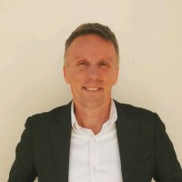

<myfigure>

</myfigure>

# Arnaud DEGARDIN
Chemical Engineer

✉️ <a emailto="degardinarnaud@gmail.com">degardinarnaud@gmail.com</a>
| 📞 available on request
| <a href="https://adegard.github.io/markdown-cv/">CV Webpage</a>
| <a href="https://www.linkedin.com/in/arnauddegardin/">Linkedin</a>
| <a href="https://github.com/adegard/">Github</a>  

🏠 <a href="https://maps.app.goo.gl/QGSkvbxSjuGPVETu6">Cesate (MI), Lombardy, Italy</a> 

## Currently

Business Developer, Technical Sales Engineer

### Summary

*I am a french Chemical Engineer living in Italy. I'm actually working as Business Developer and Sales Engineer to develop South-Europe market for Enogia, developing industrial solutions for energy effciency and Electricity production.*

### Top skills

- Sales 
- Chemical Engineering
- Six Sigma 
- Programming

### Languages

- French : native
- Italian : fluent
- English : fluent
- German : basic school knowledges

## Education

`2000-2003`
__Ecole supérieure de Chimie Physique Electronique de Lyon, Master's degree, Chemical Engineering.__

- <a href="https://www.cpe.fr/">cpe.fr</a>

`1997 - 1999`
__Université François Rabelais de Tours, Bachelor's degree, Biology.__

- <a href="https://www.univ-tours.fr/">univ-tours.fr</a>

## Occupation

`02/2024-Present`
__ENOGIA SA__, Milan, Lombardia, Italia, <a href="https://www.enogia.com/">enogia.com</a> (Company HQ based in France, Marseille)

Business Developer, South Europe

ENOGIA manufactures systems (Organic Rankine Cycle - ORC) for electricity generation from renewable sources. It allows customers to produce green electricity and to recover waste heat from different processes.

- I'm responsible for the Sales development (using email/phone prospection, participation to events...) finding new customer and Sales Agents for the Southern Europe area and Middle East.
- I'm following all the sales process steps: answering customer requests, presentations (onsite, remote), technical offers, negociation and contract redaction.
- Preliminary offers require the design of a complete solution for every customer, including:
@ Sizing of the ORC device with the optimization of the process conditions in order to maximize the efficiency (Electricity production)
@ Design EPC solutions (drawings, process engineering...) and budgeting activities for the integration parts (additional heat exchangers, cooling systems and interconnecting (piping, pumping systems system). 
  
`2019-02/2024`
__DEC S.p.A.__, Lainate, Lombardia, Italia, <a href="https://www.dec.group/">dec.group</a>

Technical Sales & Application Manager

- DEC's promotes VOC abatement solutions: mainly solvent recovery system for VOC filtration on activated carbon adsorption, and reuse after desorption, allowing Circular Economy and CO2 footprint reduction. Those systems are mainly employed in chemical, pharmaceutical industries and also in flexible packaging converting processes.
- I was representing DEC and its products to the Customers: from leads first contacts,  project feasibility study, preliminary layout, proposal definition, negociation and contract redaction.
- To fulfill this responsibility, I regularly travelled throughout Europe, North Africa, and the Middle East.
- For the leads expansion, I participate regularly to Fairs/Exhibitions and make public speaches during sectorial association's meetings.

`2012-2018`
__ASE Soc Coop.__, Saronno, Lombardia, Italia 

CEO & Sales Office Manager

- Healthcare services Company with two offices (Saronno & Como). The company were managing around 100 co-workers. The scope was the Human Resources research and selection for Healthcare services (Authorised HR agency).
- This activity allowed me to experience in managing a B2C business, meanwhile focusing on entrepreneurship aspects (especially sales, financial management and Team building).  
- Development of the HR platform for people registration and customer marketing (made in PHP+SQL).

`2010-2011`
__BOLTON MANITOBA S.p.A.__, Nova Milanese, Lombardia, Italia, <a href="https://www.boltongroup.net/">boltongroup.net</a>

Plant Development Specialist - Projects/Maintenance

- The company is involved in the production of household detergents. 
- I was responsible for the design of new plants (eg. Ethanol storage tank and dosing ayatem, hypochlorite tank and dosing system).
- to fulfill this activity, I managed to prepare P&I drawings, Data sheets, Yellow Reviews and piping/instrumentation specifications. 
- I also managed plant maintenance interventions, providing training to production people. I worked also with Software Engineer designing logical control sequences, and conducting HAZOP studies. 

`09/2002-2010`
__SOLVAY (ex-Rhodia)__, Ospiate di Bollate, Lombardia, Italia <a href="https://www.solvay.com/en/">solvay.com</a>

Chemical process engineer & Lean Six Sigma Black Belt

- This site is specialized in the production of surfactants for the industry and agriculture.
- I was working as Chemical process engineer and Six Sigma Black Belt. This qualification, allowed me to lead over 10+ international projects. 
- During my time there, I was also responsible for World Class Manufacturing (following production KPI). 
- I also designed new plants and chemical process modifications (elaboration of P&I, data sheet, specifications), for various plant modifications, meanwhile designing logical control sequences, and conducting HAZOP studies.
- I also participate to SAP-PM implementation (Plant Maintenance module of SAP software)

`03/2002-08/2002`
__ARKEMA (ex-Atofina)__, La Chambre, France, <a href="https://www.arkema.com/global/en/">arkema.com</a>

Process Engineer Internship

- Chemical Process Optimization

`09/2001-02/2002`
__LAFARGE Cement__, Marseille, France, <a href="https://www.holcim.us/">holcim.us</a>

Analytical R&D - Internship

- Thermogravimetric analyser building, with HMI control (Visual Basic programming)

`09/2001-02/2002`
__IFP (Institut Français du Pétrol)__, Lyon, France, <a href="https://www.ifpenergiesnouvelles.fr/">ifpenergiesnouvelles.fr</a>

Process Engineer - internship

- Distillation process simulator (Excel testing models for complex distillations)

## Certifications

`2006`
🏅Six Sigma Black Belt, from Six Sigma Accademy, <a href="https://www.sixsigmacouncil.org/">sixsigmacouncil.org</a>

`2008`
🏅 Fire Guard License (for Rhodia production site), <a href="https://www.silpa.org/">SILPA.org</a>

`2009`
🏅 Toxic Gas License (Ethylene Oxyde), Patente Gas Tossici - Ossido di Etilene <a href="https://www.assolombardaservizi.it/courses/gas-tossici-preparazione-agli-esami-per-il-conseguimento-della-patente-di-abilitazione/">AssolombardaServizi.it</a> 

`1997`
🏅 Brevet d’aptitude aux fonctions d’animateur <a href="https://www.jeunes.gouv.fr/le-brevet-d-aptitude-aux-fonctions-d-animateur-bafa-253">BAFA</a>

## Softwares (most important)

- Office: <a href="https://www.office.com/">Microsoft's Office</a>, <a href="https://workspace.google.com/">Google Workspace</a>
- 2D/3D drawing: <a href="https://www.autodesk.com/products/autocad/overview">Autocad</a>, <a href="https://www.bricsys.com/">Bricscad</a>, <a href="https://www.blender.org/">Blender</a>, <a href="https://inkscape.org/">Inkscape</a> 
- Stastics: <a href="https://www.minitab.com/">Minitab</a>

## Programming languages (knowledges)

- Advanced: <a href="https://www.google.com/script/start/">Google Apps Script</a>, <a href="https://www.w3schools.com/html/">HTML</a>
- Intermediate: <a href="https://www.w3schools.com/js/DEFAULT.asp">JavaScript</a>, <a href="https://en.wikipedia.org/wiki/PHP">PHP</a>, <a href="https://www.python.org/">Python</a>
- Basic: <a href="https://www.w3schools.com/sql/">SQL</a>, <a href="https://www.w3schools.com/Css/">CSS</a>, <a href="https://en.wikipedia.org/wiki/R_(programming_language)">R</a>, <a href="https://react.dev/">React.js</a>

## Recommandation

`2011`
📣 Steven Farr, <a href="https://www.linkedin.com/in/arnauddegardin/">on Linkedin</a> said:

*Arnaud is a thorough person who focuses and works through a programme or project to deliver results. He is a multi-linguist and had good empathy with those he worked with. He was an excellent Black Belt and was a pleasure to coach. 
I wish him all the best for the future and I know he will work well in many environments.*

## GDPR consent

I hereby consent to the processing of the personal data in this CV by anyone who receives this CV for the sole purpose of consideration of my skills and experience for professional opportunities <a href="https://eur-lex.europa.eu/legal-content/EN/TXT/?uri=CELEX%3A02016R0679-20160504">(General Data Protection Regulation)</a>

## Last updated 

2025

<!-- ### Footer @adegard-->

